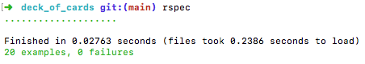

# Deck of Cards - Read all of this document before jumping into code

## Objective

You will be building a deck of cards in Ruby.   To accomplish this, you must implement a `Card` class in `card.rb` and a `Deck` class in `deck.rb`.

## Specifications

### Card

* A `Card` should be initialized with two positional arguments, a `value` and a `suit`. The value should be a number from 1-13, and the suit should be a string of either `"hearts"`, `"diamonds"`, `"clubs"` or `"spades"`.  It should be possible to write code like this: `Card.new(4, "spades")`.
* A `Card` should have public instance methods, `value`, and `suit`, that return the value of these arguments. (Hint: you will want to use instance variables and `attr_reader`.)
* A `Card` should also have a public instance method called `face`.   Face should return a string represenation of the card's value.  For instance, `Card.new(1, "hearts").face` should return the string "Ace". If the value is 2, the face should be "2", if the value is 13, the face should be "King", etc...

### Deck

* A `Deck` is made up of 52 `Cards`, so you will need to require the card file at the top of `deck.rb`.
* A `Deck` should be initialized with no arguments, but you will need to set its `@cards` instance variable inside of the `initialize` method.  Calling `Deck.new.cards` should return an array of 52 card with unique value / suit combinations.  **Hint:** you will want to make a loop of every suit, inside a loop of every value, to push each combination of value and suit into an array.
* A `Deck` should have a public method called `shuffle`, which permanently rearranges the order of the cards in its `@cards` instance variable.  Calling `Deck.new.shuffle` should return an array of shuffled cards.
* A `Deck` should have a public method called `draw`.  Calling `Deck.new.draw` should remove one of the deck's cards and return it.  There should be one less card in the deck every time its `draw` method is called.

## Definition of Done

Your goal is to make as many of the specs pass as you can.   You can run all of the specs by running `rspec -fd` from the root of this directory.  Alternatively you can run the "Deck Specks" by running `rspec spec/deck_spec.rb`, or the "Card Specs" by running `rspec spec/card_spec`.

There are some **BONUS** specs in `spec/card_spec`.  They are set to pending with an `x` in front of the word `context`.  If you finish all the regular specs, remove the `x` to turn on the bonus specs.


# Deck of cards

## Description
This is a Ruby project creates two objects: a card and a set of 52 cards.  The two objects will be tested  with the rspec library.

## installation
To clone the repository and run the rspec tests, please follow these steps:
- check if you have ruby installed on your computer
- check if you have rspec gem installed
```bash 
git clone <git@github.com:jjpuebla/deck_of_cards.git>
cd <deck_of_cards>
```
## Usage 
This project has two tests to prove functionality of two classes: Cards and Deck.  'Cards' create a card with a value and a suit.  For example: 2 of spades.  'Deck' creates the 52 cards of a deck of cards.

The first test checks the class ‘Card’ (located in file ‘cards.rb’). This test consist of 13 examples.  To run this test, use this code:
```bash
rspec spec/card_spec.rb
```
The second test checks the class "Deck"(located in file ‘deck.rb’).  This test consist of  examples.  To run this test, use this code:
```bash
rspec spec/deck_spec.rb
```
If you want to run both tests:
```bash
rspec
```
As you can see in the image, there are not failures in any of the 20 tests:


## Roadmap
With the creation of the classes 'Card' and 'Deck', the next step in this project is to use the deck of cards in the creation of card games. Any advice picking a game or contributing with the code would be appreciated.

